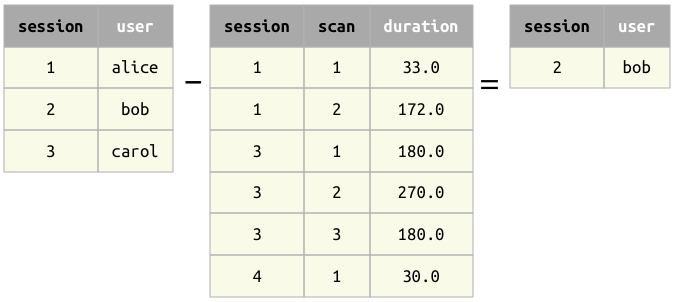

## Difference operator --

Difference example 1
: Difference from another relation

Difference example 2
: Difference from a relation with no common attributes.

Difference example 3
: Difference from an empty relation

