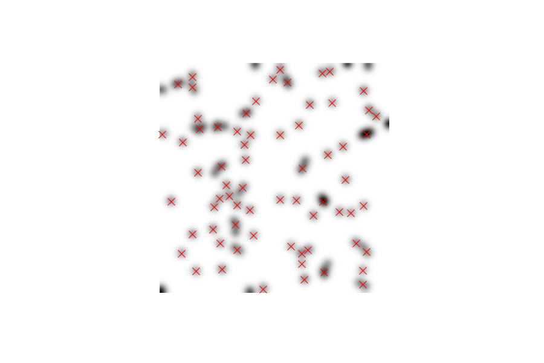

# Example: "The Experiment"

## Scenario

Three intrepid scientists Alice, Bob, and Carol are embarking on a series of groundbreaking experiments.

Acquisition 

: Only one experiments can be done on the same date and only one of the scientists conducts the experiment for that day. In each experiment, the experimenter acquires several grayscale images of mysterious blobs, like so:

Analysis 

: The analysis detects the blobs in the image and reports their (x,y) positions and amplitudes, like so:

Report

: Their report will print the number of experiments that a given scientist has conducted, the percentage of images that have been analyzed for that scientist, the average number of blobs per image for that scientist, and the average amplitude of blobs for that scientist.

