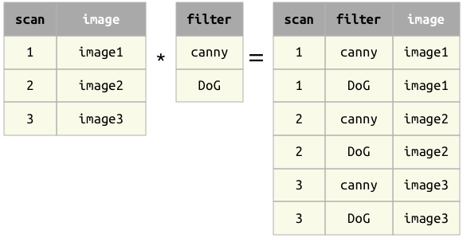

## Join operator *
The result of the join operator `a * b` contains all matching combinations of tuples from `a` and `b`.

### Principles
1. The operands `a` and `b` must be *join-compatible*: each of their common attributes must be part of the primary key or of a foreign key.
2. The primary key of the result is the union of the primary keys of the operands.

### Examples

Example 1
: When the operands have no common attributes, the result is the cross product -- all combinations of tuples.

Example 2
: When the operands have common attributes, only tuples with matching values are kept.

