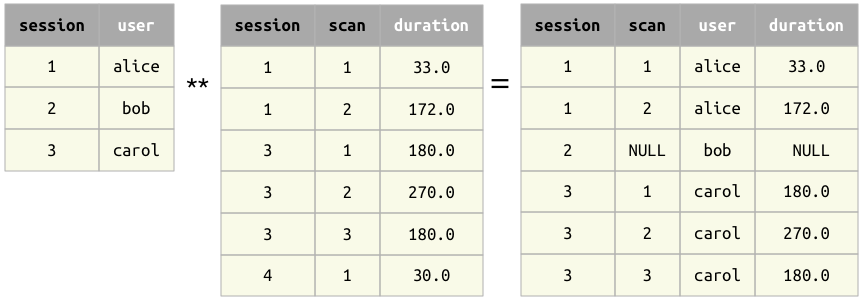

## Join operator *
The result of the join operator `a * b` contains all matching combinations of tuples from `a` and `b`.

### Principles
1. The operands `a` and `b` must be *join-compatible*.
2. The primary key of the result is the union of the primary keys of the operands.

### Examples

Example 1
: When the operands have no common attributes, the result is the cross product -- all combinations of tuples.

Example 2
: When the operands have common attributes, only tuples with matching values are kept.

### Left join
A modification of the join operator is the *left join*.  It is implemented as `a ** b` in Python and `a .* b` in MATLAB.
The left join keeps all the tuples from `a` even in the absence of the matching tuples from `b`.  For tuples with no matches in `b`, the non-key attributes from `b` are filled with NULLs.

Example 3 
: A left join

W> The left join is the only operator that may introduce NULLs in the primary key of the result.  NULLs in the primary key may produce unintuitive results in subsequent expressions.

## Properties

1. When `a` and `b` have the same primary key, the join `a*b` can be thought of as the set intersection `a \cap b`.
2. Commutative property:  `a * b` is equivalent to `b * a`
3. Associativity property:  `a * b * c` is equivalent to `a * (b * c)`.
4. Left join is not commutative: `a ** b` is not generally equivalent to `b ** a`. 
