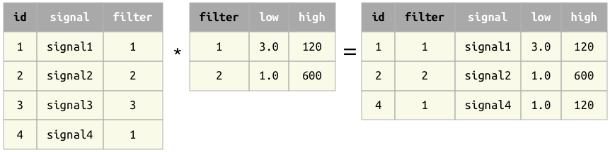

## Join operator *
The result of the join operator `A * B` contains all matching combinations of tuples from `A` and `B`.

### Principles join
1. The operands `A` and `B` must be *join-compatible*.
2. The primary key of the result is the union of the primary keys of the operands.

### Examples of join

Example 1
: When the operands have no common attributes, the result is the cross product -- all combinations of tuples.

Example 2
: When the operands have common attributes, only tuples with matching values are kept.

Example 3
: Joining on non-primary attribute 

### Left join
A modification of the join operator is the *left join*.  It is implemented as `A ** B` in Python and `A .* B` in MATLAB.
The left join keeps all the tuples from `A` even in the absence of the matching tuples from `B`.  For tuples with no matches in `B`, the non-key attributes from `B` are filled with `NULL`s.

Example 4 
: A left join

W> The left join is the only operator that can introduce `NULL`s in the primary key of the result.  `NULL`s in primary attributes may produce unintuitive results in subsequent expressions.

### Properties of join

1. When `A` and `B` have the same attributes, the join `A * B` becomes equivalent to of as the set intersection `A` {$$}\cap{/$$} `B`.
2. Commutative:  `A * B` is equivalent to `B * A`.  However, the left join is *not* commutative.
3. Associative:  `(A * B) * C` is equivalent to `A * (B * C)`.   However, the left joint is *not* associative.
