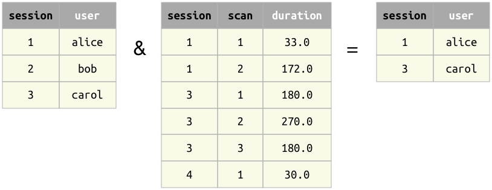
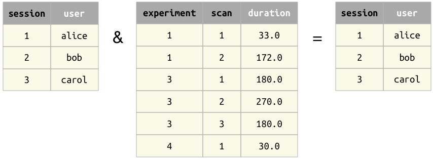
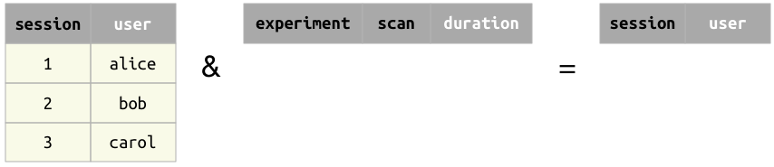

## Restriction operator `&`

The result of the restriction operator `A & cond` is a subset of the tuples from `A` that meet the condition `cond`. 
The condition `cond` may be one of the following:

* another relation,
* a mapping (e.g. `dict` in Python or `struct` in MATLAB).
* an expression in a character string.
* a collection of conditions (e.g. a `list` in Python or a cell array in MATLAB)
* an `AndList`
* A boolean expression (`True` or `False` in Python or `true` or `false` in MATLAB)

### Restriction by another relation 
When restricting one relation by another relation `A & B`, the two relations must be *join-compatible*.  The result will contain all tuples from `A` for which there exist a matching tuple in `B`. 

Restrict example 1
: Restriction with another relation

Restrict example 2
: Restriction with a relation with no common attributes

Restrict example 3
: Restriction with an empty relation

