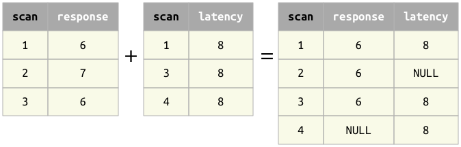

## Union operator +
DataJoint's union operator '+' acts as set union operator or the outer join relational operator depending on its operands.  These two behaviors are not distinct from each other but rather represent special cases of the same operator.

In contrast to SQL and classical relational algebra, attributes are identified by their names rather than by their positions. The operation of the union operator is therefore determined by the composition of its operands' headings.  As always, when we say that two tuples *match*, it means that the attributes with the same names have the same values in both tuples.

### Principles 
1. The result of `a + b` contains all attributes from both `a` and `b`. 
1. The result of `a + b` contains the minimal set of tuples that match all tuples in both `a` and `b` and all combinations of matching tuples of `a` and `b`.
1. The primary key of the result is the union of the primary key attributes of its operands `a` and `b`.
1.  All common attributes in `a` and `b` must be part of the primary key of either `a` or `b`.  An exception will be raised if a non-key attribute with the same name is present in both relations.
1. The common attributes in `a` and `b` must be of compatible datatypes and must belong to the primary key of either `a` or `b`.
1. The common attributes in `a` and `b` must be of a compatible data type for equality comparisons.
1. Attributes that are unique to `a` will be filled with NULLs in tuples that have no match in `a`.  Conversely, attributes that are unique to `b` will be filled with NULLs in tuples that have no match in `b`.

1.  The order of attributes in the operands does not matter and is not guaranteed in the result.

### Properties 
`a+b` is equivalent to the natural outer join operator in relational algebra.  
`a+b` is equivalent to the relational union  operator when `a` and `b` have the same sets of attributes. 

### Examples

When the arguments share the same set of attributes, `+` is equivalent to  the set union:

When the arguments share do not share any attributes, `+` is equivalent to `*`: 

In the most general case, `+` represents the outer natural join: 

W> Note that `+` may introduce NULLs.  When the two arguments have different primary keys, NULLs may appear in the primary key of the result.

