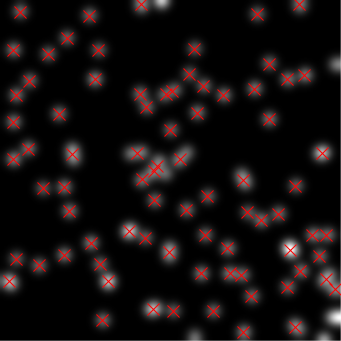

# Example 3: The Experiment
## Scenario

### Acquisition
Three intrepid scientists Alice, Bob, and Carol are embarking on a series of groundbreaking experiments.

No two experiments can be done on the same date and only one of the scientists conducts the experiment on that day. In each experiment, the experimenter acquires several grayscale images of mysterios blobs, like so:

||
|:-------:|
|*Figure 1. Mysterious blobs*|

### Analysis 
The analysis detects the blobs in the image and reports their (x,y) positions and amplitudes, like so:

||
|:-------:|
|*Figure 2. Detected blobs*|

### Reporting
Their report will print the number of experiments that a given scientist has conducted, the percentage of images that have been analyzed for that scientist, the average number of blobs per image for that scientist, and the average amplitude of blobs for that scientist.

# Python

## Preliminaries
Here we provide Python functions that will simulatate the data acquisition and analysis.  Provided here only for completeness, they are not part of the main discussion.

```python
# Preliminaries:
# This section provides functions that will be used by your project.
import numpy as np
import time
from scipy import ndimage


def make_image(seed=None, ncells=100, size=256):
    """
    make blob image
    """
    np.random.seed(seed)
    im = np.zeros((size, size))
    points = (size*np.random.random((2, ncells))).astype(np.int)
    im[points[0], points[1]]= 1 + 0.1*np.random.normal(size=ncells)
    return ndimage.gaussian_filter(im, sigma=size/(6.*np.sqrt(ncells)))


class BlobFail(Exception):
    pass


def find_blobs(im, fail_rate=0.02, delay=0.1):
    """
    a generator of x, y coordinates of blobs
    """
    for y, x in zip(*np.where(
            im > ndimage.filters.percentile_filter(im, 85, size=3))):
        if np.random.random() < fail_rate:
            raise BlobFail
        time.sleep(delay)
        yield x, y
```


## Implementation

### The `blobs` database
First, let's create the database called `blobs`:

```python
import datajoint as dj
schema = dj.schema('tutorial_blobs', locals())
```

### `Scientist` and `Experiment`
Now, let's create the table `Scientist` so that we can refer to individual scientists later.  We will populate it implicitly using the `contents` property.  The table is of type `dj.Lookup`, suggesting that its information is rather static, not meant to be entered for each experiment.

```python
@schema 
class Scientist(dj.Lookup):
    definition = """    # scientists in the lab
    name : varchar(8)   # scientist name
    """    
    contents = [['Alice'], ['Bob'], ['Carol']]
```

The `definition` property defines the structure of the table.  The first line contains the table comment, describing what information is represented by rows in the table.  This table only has one attribute (column) `name` of type variable-length character string up to 8 characters `varchar(8)`.  The column also has a comment describing its meaning.

Now let's define the `Experiment` table containing the information about a day's experiment.  

```python
@schema
class Experiment(dj.Manual):
    definition = """ # daily experiment
    exp_date : date   # experiment date
    --- 
    -> Scientist
    notes="" : varchar(255)  # free notes about the experiment
    """
```

The `Experiment` table is of type `dj.Manual`, suggesting that it contains information entered manually in each experiment.

Its definition contains a dividing line `---`.  The attributes above the dividing line comprise the table's *primary key*.  No two entries in a table can have the same values of the primary key attributes.  The primary key attributes are also  indexed to speed up searches by their values.  For our `Experiment`, it means that `exp_date` is the most efficient way to identify experiments.

The definition also contains the reference `-> Scientist`.  This reference pastes the primary key attributes of `Scientist` into the definition of `Experiment`.  The primary key of `Scientist` is `name`.  This reference also sets a *foreign key* constraint, which prevents entering any values that are not also present in the referenced table. 

Finally, `Experiment` contains the attribute `notes` of type `varchar(255)`.  The definition also specifies its default value, the empty string  `""`.

Thus `Experiment` has attributes `exp_date`, `name`, and `notes`.

You may confirm this by previewing the table's `heading`:

```
>>> Experiment().heading                                                                                    
# daily experiments                                                                                          
exp_date             : date                         # experiment date                                       
---                                                                                                         
name                 : varchar(8)                   # scientist name                                        
notes=""             : varchar(255)                 # free notes about the experiment    
```

You may also get a quick preview of the contents of the tables:

```
>>> Scientist()

scientists in the lab                                                                                             
*name                                                                                                       
+-------+                                                                                                   
Alice                                                                                                       
Bob                                                                                                         
Carol                                                                                                       
 (3 tuples) 
```

```
>>>  Experiment()                                                                                            

daily experiments
*exp_date    name     notes                                                                                 
+----------+ +------+ +-------+                                                                             
                                                                                                            
 (0 tuples)  
```

The primary key attributes are indicated with an asterisk `*`.

### Entering expriment data
Let's pretend to conduct some experiments by entering data into `Experiments`:

```python
e = Experiment()

# enter one at a time
e.insert1(dict(exp_date="2016-10-01", name="Carol", notes="awesome data!"))
e.insert1(dict(exp_date="2016-10-02", name="Bob"))
e.insert1(('2016-10-03', 'Alice', 'found a piece of dark matter.'))

# enter several
e.insert((
        ("2016-10-04", "Carol", "stunning!"),
        ("2016-10-05", "Bob", "inexplicable patterns."),
        ("2016-10-06", "Alice", "A boson got loose.")
    ))
```

Preview the data:

```
>>> Experiment()  

daily experiments                                                                                          
*exp_date      name      notes                                                                              
+------------+ +-------+ +------------+                                                                     
2016-10-01     Carol     awesome data!                                                                      
2016-10-02     Bob                                                                                          
2016-10-03     Alice     found a piece                                                                      
2016-10-04     Carol     stunning!                                                                          
2016-10-05     Bob       inexplicable p                                                                     
2016-10-06     Alice     A boson got lo                                                                     
 (6 tuples) 
```

Note that the insert 

```
>>> Experiment().insert1(['2016-10-01', 'Bob', 'I have a bad feeling about this.']) 

pymysql.err.IntegrityError: (1062, "Duplicate entry '2016-10-01' for key 'PRIMARY'")  
```
fails because the entry for `2016-10-01` already exists.

The insert 

```
>>> Experiment().insert1(['2016-10-07', 'Alce', '']) 

pymysql.err.IntegrityError: (1452, 'Cannot add or update a child row: a foreign key constraint fails (`tutorial_blobs`.`experiment`, CONSTRAINT `experiment_ibfk_1` FOREIGN KEY (`name`) REFERENCES `#scientist` (`name`)
 ON UPDATE CASCADE)')
```
fails because the name `Alce` is mispelled and is not found in `Scientist`. 

If the `insert` method is used to enter multiple entries at once and any one of the entries is invalid, then none of the entries are inserted.


### Acquisition
Let's now define the table `Acquire` to acquire the results of experiments.

```python
import numpy as np

@schema
class Acquire(dj.Imported):
    definition = """   # Image data from one experiment
    -> Experiment 
    ---
    timestamp = CURRENT_TIMESTAMP  : timestamp  
    """
    
    class Image(dj.Part):
        definition = """
        -> Acquire
        image_id : tinyint unsigned   # image number within each experiment
        ---
        image : longblob  # acquired image
        """
        
    def _make_tuples(self, key):
        self.insert1(key)
        number_of_images = np.random.randint(20)
        part = self.Image()
        for i in range(number_of_images):
            part.insert1(
                dict(key, image_id=i, image=make_image()))
```

There is a lot going on here. We defined two new tables `Acquire` and `Acquire.Image`.  

`Acquire` makes a foreign key reference to `Experiment` from its primary key and has no other attributes in its primary key.  This means that `Acquire` has a 1:1 relationship to `Experiment`: at most one `Acquire` entry can exist for every `Experiment` entry.

`Acquire` also has the attribute `timestamp` of type `typestamp` and default value of `CURRENT_TIMESTAMP`. 

`Acquire` is of type `dj.Imported`, which suggests that 


